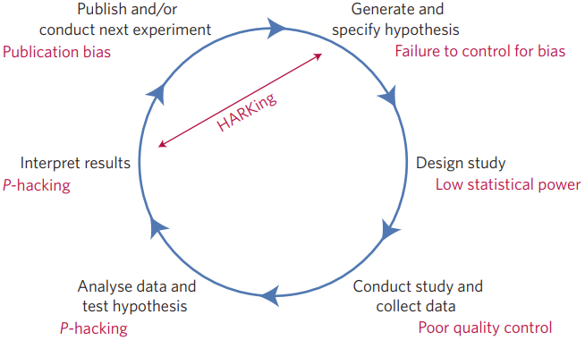
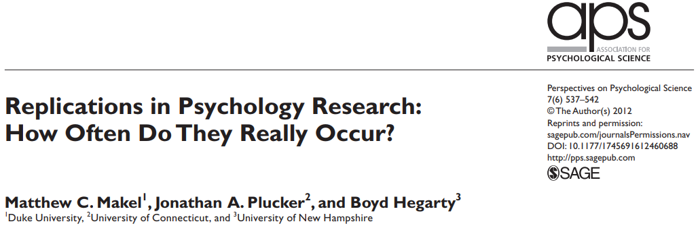
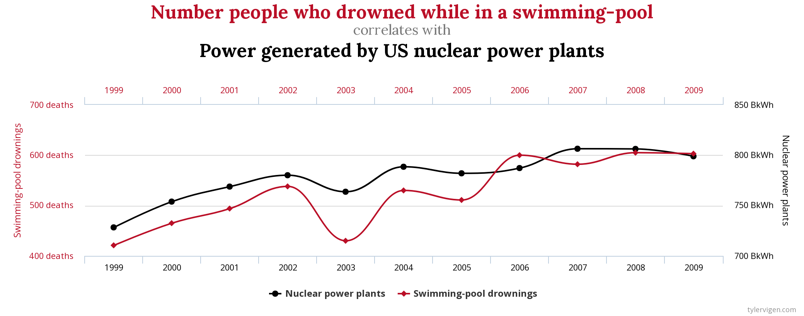
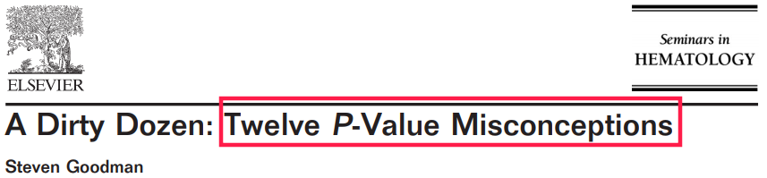
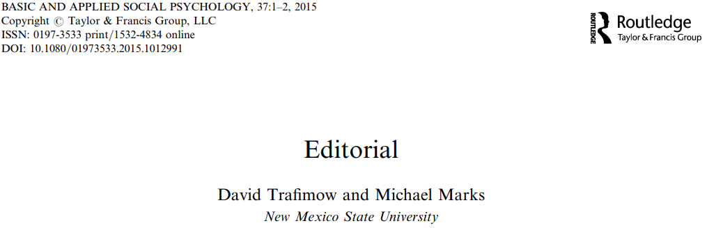
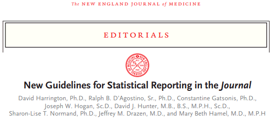
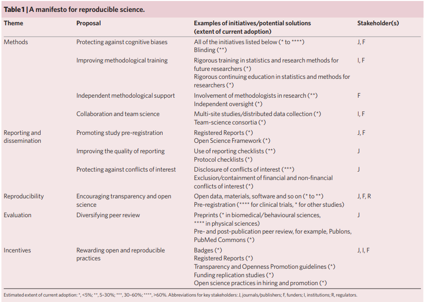
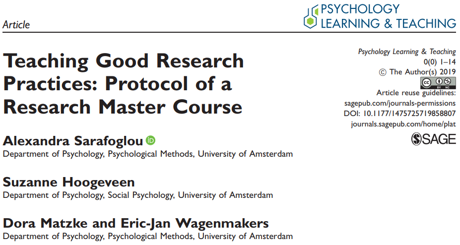
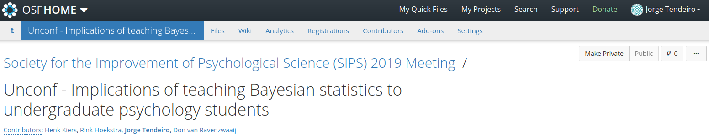
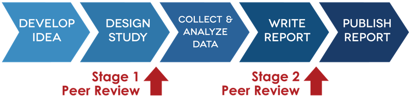

```{r setup, include = FALSE, fig.align = 'center'}
knitr::opts_chunk$set(
  echo      = FALSE, 
  fig.cap   = '', 
  out.extra = 'style="background-color: #000000; padding:5px; display:block; margin:auto;"'
  ) 
```

<!-- To print to PDF, run: 
pagedown::chrome_print("Nagoya-10-Aug-2019-Part1.html")
-->

## Today
<!-- add div element table of content for javascript to fill -->
<div id="toc"></div>

# Fraud {.section}

## 定義
Fraud = 科学における不正行為.

- データの偽造または加工.
- 意図的であり、故意的でないもの.
- すべての科学的研究が <span style="color:red">問われる</span>.
- QRPsとは際立って異なるもの (next).

## 有名な例
- Diederik Stapel, 社会心理学者. 2011年 停職. [データの偽造と加工](https://www.nytimes.com/2013/04/28/magazine/diederik-stapels-audacious-academic-fraud.html?pagewanted=1&_r=0&src=recg).
- Marc Hauser, ハーバード大学心理学者. 2011年　辞職. [科学における不正行為](https://www.bostonglobe.com/metro/2014/05/29/internal-harvard-report-shines-light-misconduct-star-psychology-researcher-marc-hauser/maSUowPqL4clXrOgj44aKP/story.html).
- Jens Förster, 社会心理学者. 2017年　辞職. [データ改ざん](https://retractionwatch.com/2017/12/12/psychologist-fire-leaves-university-start-private-practice/).
<br><br><br>

今日は科学における不正行為*そのもの*については
詳しくお話しません.

もっと発見しにくくて撲滅するのが難しいものについてお話します:

<p align="center"><span style="color:red">Questionable research practices (QRPs)</span>.</p>

# Questionable research practices<br>問題ある研究活動 {.section}

## QRPs（問題ある研究活動）
@john2012 によって作られた用語.<br>
See also @simmons2011.
<br><br>

- <span style="color:red">必ずしも</span> fraud(科学における不正行為）<span style="color:red">ではない</span>.
- 実際に*許容される範囲内の* 研究活動とその悪用も含む.
- QRPs（問題ある研究活動）に関する問題点:<br>
    * <span style="color:red">バイアス</span>を加えてしまう (典型的には, 研究者の意図を*支持する*方向にバイアスが加えられる...).
    *  第一種過誤(Type I error)の確率が上がるのを犠牲に($\gg 5\%$)<span style="color:red">power(検出力)
    </span>がつり上げられる.
    * 結果が <span style="color:red">再現されない</span>.

## QRPs（問題ある研究活動）の例
[@john2012; @schimmack2015].

- いくつかの従属変数（dependent variables）を取り除く.
- いくつかの条件を取り除く.
- <span style="color:red">覗き見(peeking)</span>: 逐次試験 --- 結果を見ながら決める:
    * $p > .05$: もっとデータを集める.
    * $p < .05$: データ収集を止める.
- $p<.05$の結果のみ報告する.
- <span style="color:red">$p$-hacking</span>: 例,
    -  $p<.05$になるかどうかに基づいて外れ値を取り除く.
    - $p = .054 \longrightarrow p = .05$.
- <span style="color:red">HARKing</span> [@kerr1998]: 探索的に得られた結果を研究課題に変えること.
- ...

## 研究者の自由度
- 研究者は <span style="color:red">多数</span> の決断を下さなければならない (実験デザイン, データ収集, 分析手法); @wicherts2016, @steegen2016.
- 研究者にとって*好ましい*結果になるよう操作することは充分、考えられることである.
- これらは *研究者の自由度*として知られている [@simmons2011].
- 結果的に: 誤検出による発見が増える [@ioannidis2005].

## Fried (2017)
<div style="float: left; width: 50%;">
```{r, out.width='100%'}
knitr::include_graphics('figures/Fried 2017.png')
```
</div>

<div style="float: right; width: 45%;">
- 主に使われている７つのうつ病のスケールには52種類の症状が含まれている.
- これらは7つの異なるスケールに相当する.
- しかし、これらはすべて 'うつ病のレベル'として解釈される.
</div>

## Turning exploratory into confirmatory analysis

From @bem2004:

> "(...) [L]et us (...) become intimately familiar with (...) the data. Examine them <span style="color:red">from every angle</span>. Analyze the sexes separately. Make up new composite indices. <span style="color:red">If a datum suggests a new hypothesis, try to find further evidence for it elsewhere in the data.</span> If you see dim traces of interesting patterns, try to reorganize the data to bring them into bolder relief. If there are participants you don't like, or trials, observers, or interviewers who gave you anomalous results, <span style="color:red">drop them</span> (temporarily). <span style="color:red">Go on a fishing expedition for something-- anything-- interesting.</span>"

This is not OK *unless* the exploration is explicity stated.

<br><br>
Daryl Bem is the author of the famous 2011 precognition paper<br>
(data used in Part 2 of today's workshop).

## 最近の有名な例...
コーネル大学のBrian Wansink教授.

[His description](https://web.archive.org/web/20170312041524/http:/www.brianwansink.com/phd-advice/the-grad-student-who-never-said-no) of the efforts of a visiting Ph.D student:

> I gave her a <span style="color:red">data set</span> of a self-funded, failed study which had <span style="color:red">null results</span> (...). I said, "This cost us a lot of time and our own money to collect. <span style="color:red">There’s got to be something here</span> we can salvage because it’s a cool (rich & unique) data set." I had three ideas for potential Plan B, C, & D directions (since Plan A had failed). I told her what the analyses should be and what the tables should look like. I then asked her if she wanted to do them.

> Every day she came back with puzzling new results, and every day we would scratch our heads, ask "Why," and <span style="color:red">come up with another way to reanalyze the data</span> with yet another set of plausible hypotheses. Eventually <span style="color:red">we started discovering solutions</span> that held up regardless of how we pressure-tested them. I outlined the first paper, and she wrote it up (...). This happened with a second paper, and then a third paper (which was one that was based on her own discovery while digging through the data).

これは *クリエイティブ* または *型にはまらない考え方*といったものではない.

<span style="color:red">これは QRPing　（問題ある研究活動）である.</span>

## Wansink教授はどうなったか?
- かなり批判され, 彼の研究は精査された [e.g., @vanderzee2017].
- 100以上におよぶ間違い が４本の論文から発見された...
- 現在では <span style="color:red">40本</span> (!!) の論文が [撤回されている](http://retractiondatabase.org/RetractionSearch.aspx#?auth%3dWansink%252c%2bBrian) (as of July 2019).
- １年に及ぶ国際的な調査の結果, 彼は [辞職](https://news.cornell.edu/stories/2018/09/provost-issues-statement-wansink-academic-misconduct-investigation)へと追い込まれた.

## これって本当に *そこまで* いけない事なの?...
[もちろんいけません](https://www.westernalliance.org.au/2018/05/restoring-trust-in-science-what-are-questionable-research-practices).

- @martinson2005: "Scientists behaving badly".
- @fanelli2009: Meta-analysis shows evidence of science misconduct.
- @john2012: Evidence for QRPs in psychology.
- @mobley2013: Reported evidence of pressure to *find* significant results.
- @agnoli2017: Evidence of QRPs, now in Italy.
- @fraser2018: In other fields of science.
<br><br>

興味深いことに、研究における不正行為は長い間懸念されてきた [see @babbage1830].
<br><br>

参考までに:<br>
数名の研究者は、現在の研究における現状は*それ程悪くない*としている[e.g., @fiedler2016].

## 研究の事前登録(preregistration)をすればQRPs（問題ある研究活動）はなくなるのか?...

残念ながら, （まだ）そうはならない.

ちなみに、(2019年7月の）日本の研究グループ(九州大学）でも研究の事前登録がなされています：

> Ikeda, A., Xu, H., Fuji, N., Zhu, S., & Yamada, Y. (2019). *Questionable research practices following pre-registration* [Preprint]. doi: [10.31234/osf.io/b8pw9](https://doi.org/10.31234/osf.io/b8pw9)

# But *why*?...<br>*なぜ*事前登録だけではQRP（問題ある研究活動）はなくならないのか?... {.section}

## なぜQRP（問題ある研究活動）は蔓延しているのか?
それはインセンティブ（誘因）と深く関係がある [@nosek2012; @schonbrodt2015].

- "Publish or perish"（論文などを書かない学者は消滅する）:<br>
より多くの論文を、より権威あるジャーナルに出版しなければならないという現実.
    - ジャーナルは提出されたうちのごく一部の論文しか出版しない.
    - ジャーナルは否定的な結果(予期されていない結果)を出版したがらない...
- 終身雇用のポジションを得るため.
- 研究費を得るため.
- 名声 (賞, マスコミに注目される等).
- ...
<br><br><br>

しかし, <span style="color:red">忘れてはならないのは</span>, <span style="color:green">研究者の最善の意図を持ってしても</span>問題ある研究活動は起こり得るということである.

- 不十分な統計科目の教育 (そう、統計学者はこの点を理解すべきであると思います!...).
- 各分野にある永続的な伝統.

# (I)reproducibility<br>再現性 {.section}

## 再現できる研究への脅威
<div style="float: left; width: 75%;">
```{r, out.width='80%'}

```
</div>
<div style="float: left; width: 20%;">
@munafo2017
</div>

<div style="float: left; width: 100%;">
- 研究における仮説演繹法.
- <span style="color:red">赤</span>での記述: このモデルにおける潜在的な脅威.
</div>

## 再現実験（追試）の欠如
つい最近[@makel2012].
<br>

```{r, out.width='80%'}

```

- 心理学における再現率が非常に低い (推定1%未満).
- 2012年までは, 主な再現実験は<span style="color:red">うまくいっていた</span>!!
- しかし, 多くのケースにおいて、オリジナルの研究も追試研究も同日研究者によって報告されていた...
- Conflict of interest(利益の衝突)?...

## 有名な [追試の失敗](https://bit.ly/2y7qeer)
- [マシュマロテスト](https://www.vox.com/science-and-health/2018/6/6/17413000/marshmallow-test-replication-mischel-psychology) [@watts2018]
- [自己消耗](https://digest.bps.org.uk/2017/12/14/strongest-evidence-yet-for-ego-depletion-the-idea-that-self-control-is-a-limited-resource/) [@hagger2016; @vadillo2018; @friese2019]
- [パワーポージング](https://www.ted.com/talks/amy_cuddy_your_body_language_shapes_who_you_are#t-543464) [@ranehill2015]
- [スタンフォード監獄実験](https://medium.com/s/trustissues/the-lifespan-of-a-lie-d869212b1f62) [@reicher2006;@griggs2014]
- [表情フィードバック仮説](https://digest.bps.org.uk/2016/09/01/no-reason-to-smile-another-modern-psychology-classic-has-failed-to-replicate/) [@wagenmakers2016]
- [Newborn babies’ imitation](https://digest.bps.org.uk/2016/05/20/a-classic-finding-about-newborn-babies-imitation-skills-is-probably-wrong/) [@oostenbroek2016]
- [ブロッキング効果](https://www-nature-com.proxy-ub.rug.nl/news/psychologists-fail-to-replicate-well-known-behaviour-linked-to-learning-1.20659) [@maes2016]
- [ステレオタイプ・スレット](https://www.nationalreview.com/corner/another-replication-failure-stereotype-threat-is-probably-empty/) [@flore2019]
- [表情](https://www.popsci.com/article/science/facial-expressions-arent-universal-we-thought/#page-2) [@gendron2018]
- [ESP](https://www.theguardian.com/science/2012/mar/15/precognition-studies-curse-failed-replications), of course! [@ritchie2012;@galak2012]
- The Mozart Effect [@steele1999; @mckelvie2002]
- ...

# Didn't we see this coming?<br>これは予測できる事ではなかったのか? {.section}
## Meehl (1967)
<div style="float: left; width: 40%;">
```{r, out.width='70%'}
knitr::include_graphics('figures/Meehl.jpg')
```
</div>

<div style="float: right; width: 55%;">
我々がいかに不完全に仮説を立てているか (see [Gelman](https://statmodeling.stat.columbia.edu/2016/05/06/needed-an-intellectual-history-of-research-criticism-in-psychology/)):

> "It is not unusual that (...) this *ad hoc* challenging of auxiliary hypotheses is repeated in the course of a series of related experiments, in which <span style="color:red">the auxiliary hypothesis involved in Experiment 1</span> (...) <span style="color:red">becomes the focus of interest in Experiment 2</span>, which in turn utilizes further plausible but easily challenged auxiliary hypotheses, and so forth. In this fashion a zealous and clever investigator can slowly wend his way through (...) a long series of related experiments (...) <span style="color:red">without ever once refuting or corroborating</span> so much as a single strand of the network."

</div>

## Say what?...
```{r, out.width='100%'}

```

[http://www.tylervigen.com/spurious-correlations](http://www.tylervigen.com/spurious-correlations)

## Cohen (1962)
<div style="float: left; width: 40%;">
```{r, out.width='70%'}

```
</div>

<div style="float: right; width: 55%;">
Low-powered experiments (検出力の低い実験):

> "(...) It was found that the average power (probability of rejecting false null hypotheses) over the 70 research studies was .18 for small effects, .48 for medium effects, and .83 for large effects. These values are deemed to be <span style="color:red">far too small</span>."
<br><br>
"(...) it is recommended that investigators use <span style="color:red">larger sample sizes</span> than they customarily do."

</div>

## Kahneman (2012)
See [here](https://www.nature.com/news/polopoly_fs/7.6716.1349271308!/suppinfoFile/Kahneman%20Letter.pdf).

<div style="float: left; width: 40%;">
```{r, out.width='70%'}

```

ノーベル賞受賞者, 2002.
</div>

<div style="float: right; width: 55%;">
プライミング効果について (かなり一般的な所見...):

> "The storm of doubts is fed by (...) the recent exposure of fraudulent researchers, general concerns with replicability (...), multiple reported failures to replicate salient results (...), and the growing belief in the existence of a pervasive file drawer problem (...)."
<br><br>
"My reason for writing this letter is that <span style="color:red">I see a train wreck looming</span>."
<br><br>
"I believe that you should <span style="color:red">collectively do something</span> about this mess."

</div>

## Timeline of a train wreck
```{r, out.width='100%'}
knitr::include_graphics('figures/Gelman 2016.png')
```

- Gelman教授はブログに印象深い再現危機についての見解を公開しています[timeline](https://statmodeling.stat.columbia.edu/2016/09/21/what-has-happened-down-here-is-the-winds-have-changed/).
- Gelman教授の批判の批判も含め、このブログは一見の価値があります!<br>
(versus Susan Fiske's [position](https://www.psychologicalscience.org/observer/a-call-to-change-sciences-culture-of-shaming)).

## Timeline of a train wreck
See also this impressive dynamic plot:<br>
[https://psyborgs.github.io/projects/replication-in-psychology/](https://psyborgs.github.io/projects/replication-in-psychology/)

```{r, out.width='70%'}
knitr::include_graphics('figures/psyborgs.png')
```

# $p$-values<br>$p$ー値{.section}

## 定義
> Probability of an effect at least as extreme as the one we observed, *given that $\mathcal{H}_0$ is true*.<br>
(*$\mathcal{H}_0$が正しいとして*、測定された効果(effect)が少なくともそれ同等かそれ以上に観測される確率)

\[\fbox{$ p\text{-value} = P\left(X_\text{obs} \text{ or more extreme}|\mathcal{H}_0\right) $}\]

この定義、わかりにくいですよね?...

## 実際に自分で試してみましょう
以下を読んでみましょう[@oakes1986; @falk1995; @haller2002; @gigerenzer2004]:

> *Suppose you have a treatment that you suspect may alter performance on a certain task. You compare the
means of your control and experimental groups (say, 20 subjects in each sample). Furthermore, suppose you
use a simple <span style="color:red">independent means $t$-test</span> and your result is <span style="color:red">significant</span> ($t = 2.7$, $df = 18$, $p = .01$). Please mark
each of the statements below as "true" or "false."* False *means that the statement does not follow logically
from the above premises. Also note that several or none of the statements may be correct.*

## 自分で試してみよう
```{r, out.width='100%'}
knitr::include_graphics('figures/Gigerenzer p values.png')
```

Try it!: [rebrand.ly/pvalue](https://rebrand.ly/pvalue)

<!-- Poll here: http://www.polljunkie.com/poll/yezkij/what-is-a-p-value/admin -->
<!-- Shorter: https://rebrand.ly/pvalue -->
<!-- Available only until 31 August 2019 -->

## 結果
**すべての** 文は<span style="color:red">間違っています</span>.

## 結果
では生徒と先生達はこれらの見方をどのように理解しているでしょうか？

```{r, out.width='30%'}
knitr::include_graphics('figures/Gigerenzer p values 2.png')
```

これは2004年のものです. でもそれ以降、改善は見られていません...

## Goodman (2008)

```{r, out.width='60%'}

```
<br>

```{r, out.width='85%'}
knitr::include_graphics('figures/Goodman2.png')
```

## Greenland et al. (2016)

```{r, out.width='80%'}
knitr::include_graphics('figures/Greenland.png')
```

<br><br><br>

この論文は @goodman2008 を拡張したもので、<span style="color:red">25 個の誤った解釈</span>について詳しく述べられています.

## *The American Statistician* (2019)
43本の論文による特別号を出版[@wasserstein2019].

<p align="center"><span style="color:red">"$p<.05$"の世界の向こう側</span></p>

# Confidence intervals<br>信頼区間 {.section}

## 他のより良い選択肢はあるのか？
- 信頼区間 (Confidence Intervals; CIs)は仮説検定の代替推定手段としてよく推奨される.
- 例）the Wilkinson Task Force [@wilkinson1999]:

> "(...) it is hard to imagine a situation in which a dichotomous accept–reject decision is better than reporting an actual $p$ value or, better still, a <span style="color:red">confidence interval</span>.”

- でも、信頼区間は本当に代替案として優れているのか?

## 定義
例） @hoekstra2014.

> A (say) 95% CI is a numerical interval found through a procedure that, if repeated across a series of hypothetical data, leads to an interval covering the true parameter 95% of the times.

- 信頼区間は<span style="color:red">手法(procedure)</span>のパフォーマンスの特性を示すものとして算出される:<br>
長期的にみて、<span style="color:red">手法(procedure)</span>がどのようなパフォーマンスをみせると予測されるか？
-　パラメーターの信頼区間は<span style="color:red"> パラメーターの推定値付近</span>に構成される.
- しかし、信頼区間は推定されたパラメーターの特性を直接的に示すものでは(<span style="color:red">まったく</span>!)ない！
<br><br>

頭の中が混乱していますか?<br>
ほとんどの心理学者も同じです...

## 自分で試してみましょう
@hoekstra2014 を参考に, @gigerenzer2004 による$p$ー値の研究を模倣した.

```{r, out.width='75%'}
knitr::include_graphics('figures/Hoekstra2014 I.png')
```

## 自分で試してみましょう
```{r, out.width='60%'}
knitr::include_graphics('figures/Hoekstra2014 II.png')
```

Try it!: [rebrand.ly/confint](https://rebrand.ly/confint)
<!-- Poll here: http://www.polljunkie.com/poll/ykmrid/what-is-a-confidence-interval-hoekstra-et-al-2014 -->
<!-- Shorter: https://rebrand.ly/confint -->
<!-- Available only until 31 August 2019 -->

## 結果
**すべての**文は <span style="color:red">間違っています</span>.

## 結果
でもどのように生徒と先生達はこれらのステートメントを理解しているでしょうか？

```{r, out.width='45%'}
knitr::include_graphics('figures/Hoekstra2014 III.png')
```

## 何が正解なの?...
> “If we were to repeat the experiment over and over, then 95% of the time the confidence intervals contain the true mean.”

とっても参考になりますよね?!
<br><br><br>

心に留めておくべきこと:<br>
今日のワークショップの第２部で扱う<span style="color:red">ベイズの信用区間</span>を解釈する時にこの事を覚えておいて下さい!
<br><br><br>

ちなみに、全員がHoekstra氏の研究[@garcia-perez2016; @miller2016; see also a reply by @morey2016]を支持している訳ではない.

# Publication policies<br>出版の方針{.section}

## Psychological Science (Eich, 2014)
```{r, out.width='90%'}
knitr::include_graphics('figures/Psychological Science 2014.png')
```

## Basic and Applied Social Psychology
```{r, out.width='80%'}

```

> "The Basic and Applied Social Psychology (BASP) (...) emphasized that the null hypothesis significance testing procedure (NHSTP) is <span style="color:red">invalid</span> (...). From now on, <span style="color:red">BASP is banning the NHSTP</span>."

実際は*うまくいったのか*？see @fricker2019.

## Child Adolescent Mental Health
```{r, out.width='70%'}
knitr::include_graphics('figures/CAMH 2018.png')
```

> (...) I will encourage authors to <span style="color:red">provide replication syntax and data</span> through public repositories. Moreover, I will encourage the journal to <span style="color:red">focus on a manuscript’s research design</span> and the author’s justification thereof, <span style="color:red">rather than the results</span>, with the aim of ensuring that transparent studies that explore a research question with equipoise, will be published.

## The New England Journal of Medicine
```{r, out.width='60%'}

```

Editorial [@harrington2019].

> "(...) a requirement to <span style="color:red">replace $p$ values</span> with estimates of effects or association and 95% confidence intervals"

# What do statistical associations advice?<br>statistical associations(統計学協会)はどうアドバイスしているのか? {.section}

## Wilkinson Task Force 1999
多くのアドバイスの一部抜粋、

- $p$ー値のみに注目しない.
- 効果サイズ(effect sizes)を記述する.
- 検出力分析(power analyses)を記述する.
- モデルの仮定(model assumptions)を調べる.

> "Novice researchers err either by overgeneralizing their results or, equally unfortunately, by overparticularizing."

## ASA 2016 (Wasserstein & Lazar, 2016)
```{r, out.width='70%'}
knitr::include_graphics('figures/Wasserstein2016.png')
```

6つの原則:

1. $p$-値は特定の統計モデルに対して、いかにデータが不適合であるかを示せる.
2. $p$-値は研究仮説の正しさを示す確率、および、データがランダムによってのみ得られる確率を示すものではない.
3. 科学的結論、ビジネスまたは政策の判断を $p$-値が特定の値を越えるかどうかのみによって決めるべきではない.
4. 適切な推定をするためには、すべてを報告し、透明性を保たなければならない.
5. $p$-値または統計的有意性は効果の程度(effect size)や結果の重要性を示す指標ではない.
6. $p$-値自体はモデルや仮説の適合性を示すものではない.

## ASA 2019 (Wasserstein et al., 2019)
```{r, out.width='80%'}
knitr::include_graphics('figures/Wasserstein2019.png')
```

これは43(!!)本の論文からなる特別号の編集者のコメントである.

主なアイデア:

- 禁止するだけでは充分ではない-- いくつかの*具体案*が示されている.
- ただ...「統計的有意差」という表現は<span style="color:red">**使うべきではない**</span> .

> "(...) it is time to <span style="color:red">stop</span> using the term “statistically significant” entirely. Nor should variants such as “significantly different,” “$p < 0.05$,” and “nonsignificant” survive, whether expressed in words, by asterisks in a table, or in some other way."

But:

> "Despite the limitations of $p$-values (...), however, we are not recommending that the calculation and use of continuous
$p$-values be discontinued. Where $p$-values are used, they should be reported as continuous quantities (e.g., $p = 0.08$).
They should also be described in language stating what the value means in the scientific context."

- これだけ行えば良いという解決法はない:

> "What you will NOT find in this issue is one solution that majestically replaces the outsized role that statistical significance has come to play."

- <span style="color:red">不確定性を受け入れる</span> (しつこいようですが!). <br>
よく考え、オープンにし、謙虚である必要がある.

- ジャーナルの編集, 教育, そしてその他の組織のシステムを変える必要がある.
<br>
その為には: ジャーナル、研究資金提供機関、教育、そしてキャリアシステムを変える必要がある.

- （当然、時間はかかりますが）再現性、実験材料やデータを公表し、信頼できるシステムを評価し、現在の「"publish or perish"（論文を出版するか滅びるか）」というシステムを変える必要がある.

## ASA 2019: ベイズ統計の推奨もしている
```{r, out.width='50%'}
knitr::include_graphics('figures/Ruberg2019.png')
```

<!-- # What do experts advice? {.section} -->

<!-- ## @munafo2017 -->
<!-- ```{r, out.width='80%'} -->
<!-- knitr::include_graphics('figures/Mufano et al (2017) 2.png') -->
<!-- ``` -->

<!-- Methods: -->

<!-- - Protecting against cognitive biases -->
<!-- - Improving methodological training -->
<!-- - Implementing independent methodological support -->
<!-- - Encouraging collaboration and team science -->

<!-- ## @munafo2017 -->
<!-- ```{r, out.width='100%'} -->
<!--  -->
<!-- ``` -->

<!-- # Large-scale replication projects {.section} -->
<!-- ## Many Labs [@klein2014] -->
<!-- ```{r, out.width='55%'} -->
<!-- knitr::include_graphics('figures/Many Labs 1-1.png') -->
<!-- ``` -->

<!-- Replicability of 13 classic and contemporary effects across 36 independent samples totaling 6,344 participants. -->

<!-- See also Many Labs 2 [@klein2018], Many Labs 3 [@ebersole2016]. -->

<!-- ## Open Science Collaboration [@osc2015] -->
<!-- ```{r, out.width='35%'} -->
<!-- knitr::include_graphics('figures/OSC1.jpg') -->
<!-- ``` -->
<!-- <br><br> -->

<!-- A gazilion authors. -->

<!-- (For the sake of balance, and for an interesting rebuttal (!), see @gilbert2016). -->

<!-- ## The Psychological Science Accelerator -->
<!-- @moshontz2018a; 92 authors! -->

<!-- ```{r, out.width='90%'} -->
<!-- knitr::include_graphics('figures/Moshontz et al 2018.png') -->
<!-- ``` -->


<!-- # Education {.section} -->

<!-- ## @frank2012 -->
<!-- ```{r, out.width='90%'} -->
<!-- knitr::include_graphics('figures/Teaching 2012.png') -->
<!-- ``` -->

<!-- ## @chambers2017a -->
<!-- ```{r, out.width='30%'} -->
<!-- knitr::include_graphics('figures/Chambers book.png') -->
<!-- ``` -->

<!-- ## @button2018 -->
<!-- ```{r, out.width='100%'} -->
<!-- knitr::include_graphics('figures/Button2018.png') -->
<!-- ``` -->

<!-- ## @sarafoglou2019 -->
<!-- ```{r, out.width='60%'} -->
<!--  -->
<!-- ``` -->

<!-- Research Master course on open science practices. Materials freely available at [OSF](https://osf.io/v3z7q/)! -->

<!-- ## @kiers2019 -->
<!-- ```{r, out.width='100%'} -->
<!--  -->
<!-- ``` -->

<!-- # Key ideas {.section} -->
<!-- ## Registered reports (RRs) -->
<!-- Visit the [Center for Open Science](https://cos.io/rr/). -->

<!-- ```{r, out.width='75%'} -->
<!--  -->
<!-- ``` -->
<!-- <br> -->

<!-- *Prior* to data collection [@chambers2013]: -->

<!-- - Decide hypotheses, methods, and analysis. -->
<!-- <br> -->
<!-- (Eliminate several QRPs, e.g., $p$-hacking, publication bias by researchers and journals.) -->
<!-- - Peer review of paper. -->
<!-- - Conditional acceptance of paper! -->
<!-- - Not only original studies, but also replications are of value! -->

<!-- ## Registered reports (RRs) -->
<!-- As of July 2019, [204 journals](https://cos.io/rr/) use Registered Reports. -->

<!-- And recently, quite notably, [Nature](https://www.nature.com/articles/s41562-019-0652-0): -->

<!-- - January 2017: Editorial announcing RRs [@editorialnature2017]. -->
<!-- - July 2019: Editorial announcing first two RRs [@editorialnature2019]: -->
<!--     - @he2019 -->
<!--     - @brannon2019 -->

<!-- To learn: -->

<!-- - @chambers2013: Inception of RRs at Cortex in 2013. -->
<!-- - Read the [APS statement](https://www.psychologicalscience.org/publications/replication). -->
<!-- - @nosek2014: Special issue in *Social Psychology* in 2014, with examples. -->
<!-- - @chambers2014: Includes useful FAQs. -->
<!-- - @chambers2017: [Slides](https://osf.io/ux24b/) at OSF. -->

<!-- ## Preregistration -->

<!-- ## Preregistration *works* [@kaplan2015] -->

<!-- ```{r, out.width='45%'} -->
<!-- knitr::include_graphics('figures/kaplan2015.png') -->
<!-- ``` -->

<!-- ## Replication studies -->
<!-- @brandt2014 -->

<!-- ```{r, out.width='90%'} -->
<!-- knitr::include_graphics('figures/Brandt 2014.png') -->
<!-- ``` -->

<!-- ## Concern in major journals -->
<!-- @lindsay2015 -->

<!-- ```{r, out.width='75%'} -->
<!-- knitr::include_graphics('figures/Psych Science 2015.png') -->
<!-- ``` -->

<!-- > "(...) Replicability is not the only criterion of a first-rate science journal, but it had better be a <span style="color:red">fundamental</span> one." -->

<!-- > "My emphasis here is on experiments and NHST, (...) (By the way, I am enthusiastically open to submissions that make appropriate use of <span style="color:red">alternatives to NHST</span> [read: Bayes].)" -->

<!-- ## In *Nature* -->
<!-- ```{r, out.width='75%'} -->
<!--  -->
<!-- ``` -->


<!-- ## In Nature [@camerer2018] -->
<!-- > "The replications follow <span style="color:red">analysis plans reviewed by the original authors</span> and <span style="color:red">pre-registered</span> prior to the replications." -->

<!-- > The replications are high powered, with <span style="color:red">sample sizes on average about five times higher</span> than in the original studies." -->

<!-- > "We find a <span style="color:red">significant effect in the same direction</span> as the original study for 13 (<span style="color:red">62%</span>) studies, and the <span style="color:red">effect size</span> of the replications is on average <span style="color:red">about 50%</span> of the original effect size." -->

<!-- Conclusion:<br> -->
<!-- Results published in high rank journals should be considered with care until they are <span style="color:red">replicated</span>. -->

<!-- ## The PRO initiative [@morey2016a] -->
<!-- - PRO = <span style="color:red">P</span>eer <span style="color:red">R</span>eviewers' <span style="color:red">O</span>penness. -->
<!-- - Thus, guidelines for paper <span style="color:red">reviewers</span>. -->
<!-- - See [https://opennessinitiative.org](https://opennessinitiative.org). -->
<!-- <br><br><br> -->

<!-- Main [goals](https://opennessinitiative.org/the-initiative/): -->

<!-- 1. Data should be made publicly available. -->
<!-- 2. Stimuli and materials should be made publicly available. -->
<!-- 3. In case some data or materials are not open, clear reasons (e.g., legal, ethical constraints, or severe impracticality) should be given why. -->
<!-- 4. Documents containing details for interpreting any files or code, and how to compile and run any software programs should be made available with the above items. -->
<!-- 5. The location of all of these files should be advertised in the manuscript, and all files should be hosted by a reliable third party. -->

<!-- ## 'statcheck' -->
<!-- R package that can assist detecting statistical reporting of errors [@nuijten2016]. -->

# What to avoid<br>何を避けるべきか {.section}

## いじめ

- ブログ、ツイッターそしてジャーナルにおける議論は激しくなる事も度々ある.
- 当然、批判することは、研究の<span style="color:red">一部であるべきである</span>.
- もちろん、いじめるために(特にしっかりした理由なく)批判すべきではない(例 Wansink).
- 私見ですが、時に批判することだけに<span style="color:red">夢中になりすぎ</span>ている場合もある.
<br><br>

```{r, out.width='50%'}
knitr::include_graphics('figures/AmyCuddy_NYT2017.png')
```
[NYT, 2017](https://www.nytimes.com/2017/10/18/magazine/when-the-revolution-came-for-amy-cuddy.html)

(興味深い記事: 最近の反論 in [Psychological Science](https://journals-sagepub-com.proxy-ub.rug.nl/eprint/CzbNAn7Ch6ZZirK9yMGH/full).)

## 警察気取りの活動について一言
恐らく、我々自身も知られたくない内輪の秘密があることでしょう.

我々も皆、今日紹介した問題点のいくつかに該当するところがあるのではないでしょうか.

正直に告白すると:

> 私自身も該当するところがあります!!

つまり:

> *完璧な人などいない.*

 Brian Nosekの言葉を借りると (as quoted [here](https://fivethirtyeight.com/features/psychologys-replication-crisis-has-made-the-field-better/)):

> "We’re not here to *be right*. We’re here to *get it right*."

# No time today for...<br>今日は時間の都合上できませんが...

## 今日は時間の都合上、カットした内容...
- Replications projects(追試プロジェクト)
- Registered reports（登録されたレポート）
- Preregistrations（研究の事前登録）
- Education(教育)
- ...

(でもこれらの事に興味があればお話することもできます!...)
<br><br><br>

今日は*統計に限定して*お話しします.

# Bayesian statistics<br>ベイズ統計 {.section}

## 統計的推定における代替的アプローチ
休憩後:

<span style="color:red">ベイズ統計</span>
への簡単なイントロダクション


<style type="text/css">
slides > slide { overflow: scroll; }
}
</style>

# References {.section}

----
