```{r setup, include=FALSE}
knitr::opts_chunk$set(echo = FALSE)
```

# Fraud

## Definition
Fraud = scientifc misconduct.

- Falsifying or fabricating data.
- This is intentional, not accidental. 
- Puts all science under a <span style="color:red">bad light</span>.
- Markedly different from QRPs (next).

## Notable examples
Diederik Stapel, social psychologist. Suspended in 2011. [Fabricating and manipulating data] 
```{r, out.width='30%', fig.align='center', fig.cap='', out.extra='style="background-color: #000000; padding:5px; display: inline-block;"'}

```

Jens Förster, social psychologist. Resigned in 2017. [Data tampering](https://retractionwatch.com/2017/12/12/psychologist-fire-leaves-university-start-private-practice/).
```{r, out.width='40%', fig.align='center', fig.cap='', out.extra='style="background-color: #000000; padding:5px; display: inline-block;"'}

```


# Questionable research practices

## QRPs
Coin termed by @john2012a.<br>
See also @simmons2011a.
<br><br>

- Not necessarily fraud.
- Includes the (ab)use of actually *acceptable* research practices.
- Problem with QRPs:<br>
    * Introduce bias (typically, in *favor* of the researcher's intentions...).
    * Inflated power at the cost of inflated Type I error probability ($\gg 5\%$).
    * Results not replicable.

## QRPs
Some examples [@john2012a; @schimmack2015]: 

- Omit some DVs.
- Omit some conditions.
- <span style="color:red">Peeking</span>: Sequential testing --- Look and decide:
    * $p > .05$: Collect more.
    * $p < .05$: Stop.
- Only report $p<.05$ results.
- <span style="color:red">$p$-hacking</span>: E.g., 
    - exclusion of outliers dependent on $p$.
    - $p = .054 \longrightarrow p = .05$.
- <span style="color:red">HARKing</span>: Convert exploratory result into research question.
- ...

## Researcher's degrees of freedom
- Researchers have a multitude of decisions to make (experiment design, data collection, analyses performed); @wicherts2016.
- It is very possible to manipulate results *in favor* of one's interests.
- This is now known as *researcher's degrees of freedom* [@simmons2011a].
- Consequence: Inflated false positive findings [@ioannidis2005].

## A now famous example...
Prof. Brian Wansink at Cornell University.

[His description](https://web.archive.org/web/20170312041524/http:/www.brianwansink.com/phd-advice/the-grad-student-who-never-said-no) of the efforts of a visiting Ph.D student:

> I gave her a data set of a self-funded, failed study which had null results (...). I said, "This cost us a lot of time and our own money to collect. There’s got to be something here we can salvage because it’s a cool (rich & unique) data set." I had three ideas for potential Plan B, C, & D directions (since Plan A had failed). I told her what the analyses should be and what the tables should look like. I then asked her if she wanted to do them.

> Every day she came back with puzzling new results, and every day we would scratch our heads, ask "Why," and come up with another way to reanalyze the data with yet another set of plausible hypotheses. Eventually we started discovering solutions that held up regardless of how we pressure-tested them. I outlined the first paper, and she wrote it up (...). This happened with a second paper, and then a third paper (which was one that was based on her own discovery while digging through the data).

<br><br>

This isn't creative, thinking outside the box, or worthy in any way.

This is QRPing.

## What happened to Wansink?
- He was severely criticized, his work was scrutinized [e.g., @vanderzee2017].
<br>
(Over 100 (!!) errors in a set of four papers...)
- Has now 40 (!!) publications [retracted](http://retractiondatabase.org/RetractionSearch.aspx#?auth%3dWansink%252c%2bBrian) (as of July 2019).
- After a year-long internal investigation, he was forced to [resign](https://news.cornell.edu/stories/2018/09/provost-issues-statement-wansink-academic-misconduct-investigation).

## Is it really *that* bad?...
[Yes](https://www.westernalliance.org.au/2018/05/restoring-trust-in-science-what-are-questionable-research-practices).

- @martinson2005: "Scientists behaving badly".
- @fanelli2009: Meta-analysis shows evidence of science misconduct.
- @john2012a: Evidence for QRPs in psychology.
- @mobley2013: Reported evidence of pressure to *find* significant results.
- @agnoli2017: Evidence of QRPs, now in Italy.
- @fraser2018: In other fields of science.

Interestingly, science misconduct has been a longtime concern [see @babbage1830a].
<br><br>

There are also some voices against this state of affairs [e.g., @fiedler2016].


# But *why*?...

## Why risking scientific misconduct?
It is strongly related to incentives [@nosek2012a; @schonbrodt2015].

- "Publish or perish":<br>
Publish a lot, at highly prestigious journals.
- Journals only publish a fraction of all manuscripts.
- 

# (I)reproducibility

## Threats to reproducible science
```{r, out.width='60%', fig.align='center', fig.cap='', out.extra='style="background-color: #000000; padding:5px; display: inline-block;"'}
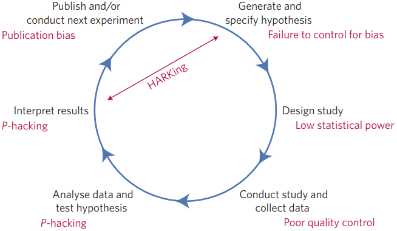
```

[@munafo2017]

## Lack of replications
Until very recently [@makel2012].

```{r, out.width='90%', fig.align='center', fig.cap='', out.extra='style="background-color: #000000; padding:5px; display: inline-block;"'}
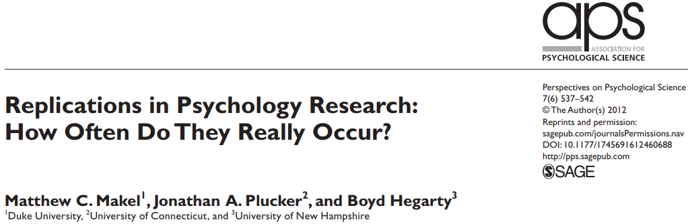
```

# Didn't we see this coming?
## @meehl1967
```{r, out.width='15%', fig.align='center', fig.cap='', out.extra='style="background-color: #000000; padding:5px; display: inline-block;"'}
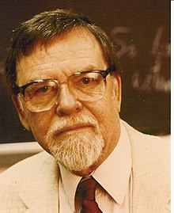
```
How poorly we build theory (Gelman's [blog](https://statmodeling.stat.columbia.edu/2016/05/06/needed-an-intellectual-history-of-research-criticism-in-psychology/)):

> "It is not unusual that (e) this *ad hoc* challenging of auxiliary hypotheses is repeated in the course of a series of related experiments, in which <span style="color:red">the auxiliary hypothesis involved in Experiment 1</span> (...) <span style="color:red">becomes the focus of interest in Experiment 2</span>, which in turn utilizes further plausible but easily challenged auxiliary hypotheses, and so forth. In this fashion a zealous and clever investigator can slowly wend his way through (...) a long series of related experiments (...) <span style="color:red">without ever once refuting or corroborating</span> so much as a single strand of the network.

## Say what?...
```{r, out.width='100%', fig.align='center', fig.cap='', out.extra='style="background-color: #000000; padding:5px; display: inline-block;"'}
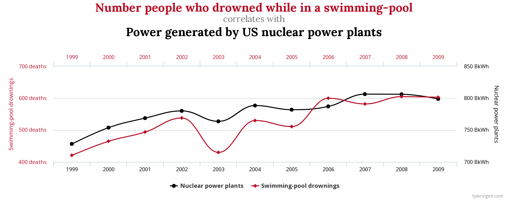
```

[http://www.tylervigen.com/spurious-correlations](http://www.tylervigen.com/spurious-correlations)

## @cohen1962
```{r, out.width='15%', fig.align='center', fig.cap='', out.extra='style="background-color: #000000; padding:5px; display: inline-block;"'}
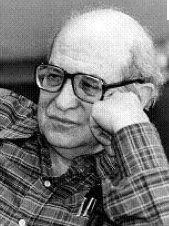
```
Low-powered experiments:

> "(...) It was found that the average power (probability of rejecting false null hypotheses) over the 70 research studies was .18 for small effects, .48 for medium effects, and .83 for large effects. These values are deemed to be <span style="color:red">far too small</span>."
<br><br>
"(...) it is recommended that investigators use <span style="color:red">larger sample sizes</span> than they customarily do."

## Timeline Gelman


# Large-scale replication projects
## Many Labs [@klein2014]
```{r, out.width='55%', fig.align='center', fig.cap='', out.extra='style="background-color: #000000; padding:5px; display: inline-block;"'}
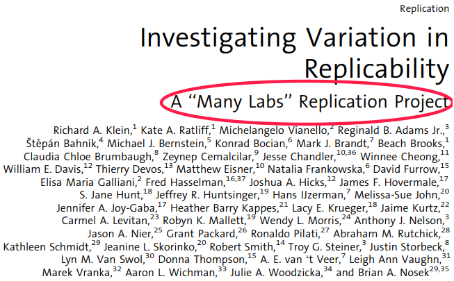
```

Replicability of 13 classic and contemporary effects across 36 independent samples totaling 6,344 participants.

See also Many Labs 2 [@klein2018], Many Labs 3 [@ebersole2016].

## Open Science Collaboration [@osc2015]
```{r, out.width='50%', fig.align='center', fig.cap='', out.extra='style="background-color: #000000; padding:5px; display: inline-block;"'}
knitr::include_graphics('figures/OSC1.jpg')
```
<br><br>

A gazilion authors.

# Publication policies

## Psychological Science [@eich2014]
```{r, out.width='90%', fig.align='center', fig.cap='', out.extra='style="background-color: #000000; padding:5px; display: inline-block;"'}
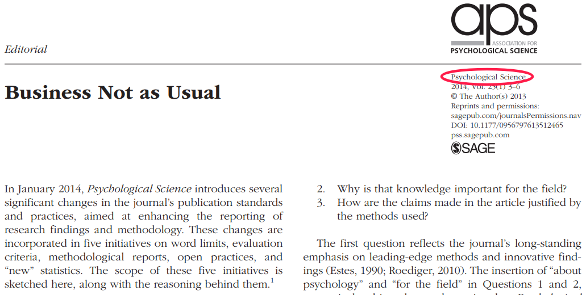
```

## Basic and Applied Social Psychology
```{r, out.width='80%', fig.align='center', fig.cap='', out.extra='style="background-color: #000000; padding:5px; display: inline-block;"'}
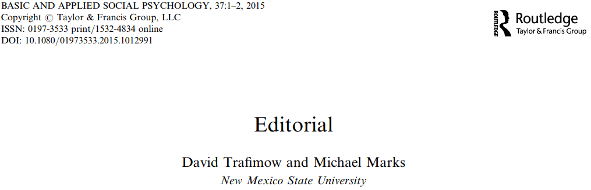
```

> "The Basic and Applied Social Psychology (BASP) (...) emphasized that the null hypothesis significance testing procedure (NHSTP) is invalid (...). From now on, BASP is banning the NHSTP."

## Child Adolescent Mental Health [@spreckelsen2018]
```{r, out.width='90%', fig.align='center', fig.cap='', out.extra='style="background-color: #000000; padding:5px; display: inline-block;"'}
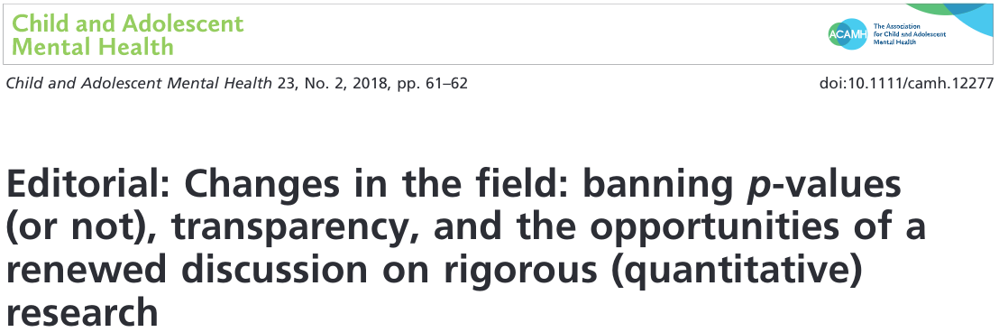
```

## The New England Journal of Medicin 
```{r, out.width='60%', fig.align='center', fig.cap='', out.extra='style="background-color: #000000; padding:5px; display: inline-block;"'}
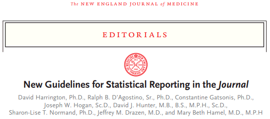
```

Editorial [@harrington2019].

> "(...) a requirement to replace P values with estimates of effects or association and 95% confidence intervals"

# Education

## @frank2012
```{r, out.width='90%', fig.align='center', fig.cap='', out.extra='style="background-color: #000000; padding:5px; display: inline-block;"'}
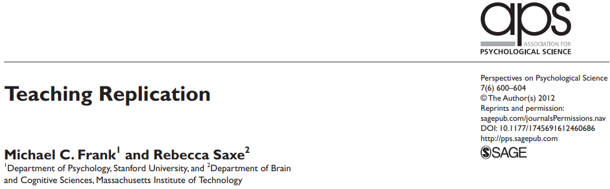
```

## @sarafoglou2019
```{r, out.width='60%', fig.align='center', fig.cap='', out.extra='style="background-color: #000000; padding:5px; display: inline-block;"'}
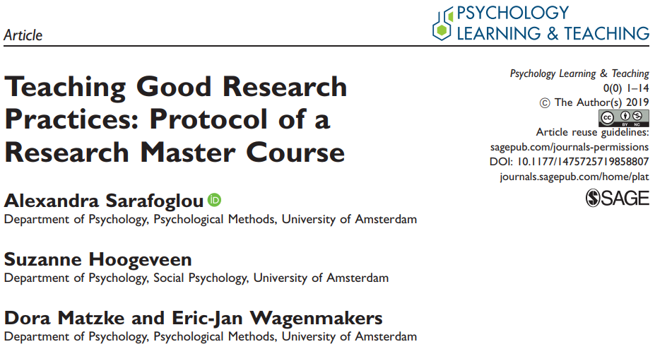
```

Research Master course on open science practices. Materials available!

## @chambers2017a
```{r, out.width='30%', fig.align='center', fig.cap='', out.extra='style="background-color: #000000; padding:5px; display: inline-block;"'}
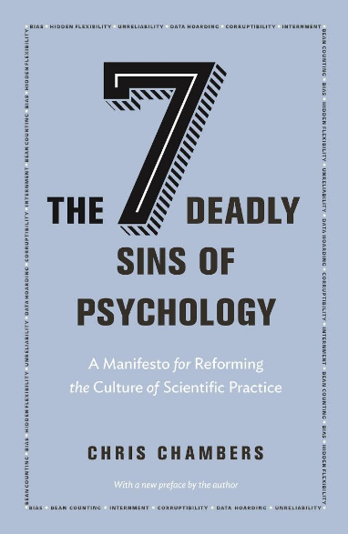
```

## @kiers2019
```{r, out.width='100%', fig.align='center', fig.cap='', out.extra='style="background-color: #000000; padding:5px; display: inline-block;"'}
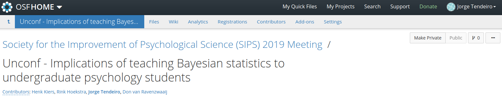
```

# $p$-values

## Definition
Probability of an effect at least as extreme as the one we observed, *given that $\mathcal{H}_0$ is true*.


\[\fbox{$ p\text{-value} = P\left(X_\text{obs} \text{ or more extreme}|\mathcal{H}_0\right) $}\]

The definition is simple enough, right?...

## Test yourself
Consider the following statement [@oakes1986; @falk1995; @haller2002; @gigerenzer2004]:

> *Suppose you have a treatment that you suspect may alter performance on a certain task. You compare the
means of your control and experimental groups (say, 20 subjects in each sample). Furthermore, suppose you
use a simple independent means $t$-test and your result is significant ($t = 2.7$, $df = 18$, $p = .01$). Please mark
each of the statements below as "true" or "false."* False *means that the statement does not follow logically
from the above premises. Also note that several or none of the statements may be correct.*

## Test yourself
```{r, out.width='100%', fig.align='center', fig.cap='', out.extra='style="background-color: #000000; padding:5px; display: inline-block;"'}
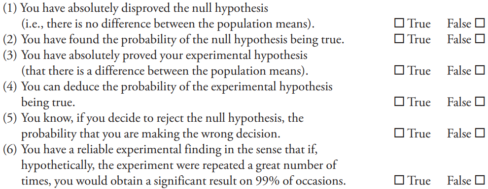
```

## Results
**All** statements are incorrect. But how did students and teachers perceive these statements?

```{r, out.width='35%', fig.align='center', fig.cap=''}
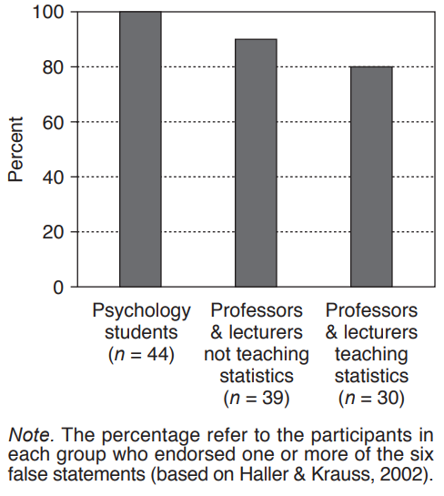
```

This was in 2004. But things did not improve since...

## @goodman2008

```{r, out.width='60%', fig.align='center', fig.cap='', out.extra='style="background-color: #000000; padding:5px;"'}
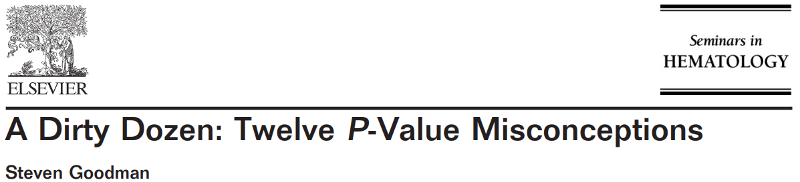
```
<br>

```{r, out.width='90%', fig.align='center', fig.cap='', out.extra='style="background-color: #000000; padding:5px;"'}
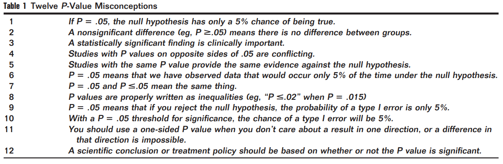
```

## @greenland2016

```{r, out.width='80%', fig.align='center', fig.cap='', out.extra='style="background-color: #000000; padding:5px;"'}
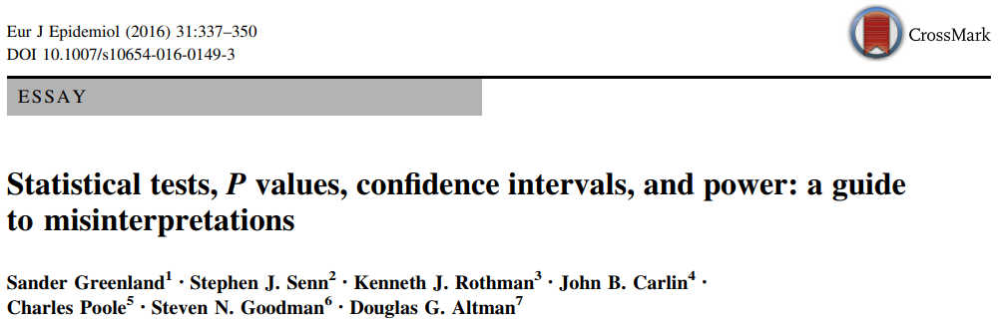
```

<br><br><br>

This paper expands @goodman2008 and elaborates on 25 (yes, 二十五!!!) misinterpretations.

## If $p$-values are inflated... What to do?
Publication bias and QRPs ($p$-hacking) inflate $p$-values. Can we "deflate" them?

- $p$-curve; see @simonsohn2014, @simonsohn2014a, or a [5 min Youtube clip](https://www.youtube.com/watch?time_continue=298&v=V7pvYLZkcK4).

> "$p$-curve is the distribution of statistically significant $p$ values for a set of studies ($ps < .05$)."

- $z$-curve; see 

See @schonbrodt2015a for a nice presentation.

# Confidence intervals

## Definition


# What do statistical associations advice?

## ASA 2016 [@wasserstein2016]
```{r, out.width='80%', fig.align='center', fig.cap='', out.extra='style="background-color: #000000; padding:5px;"'}
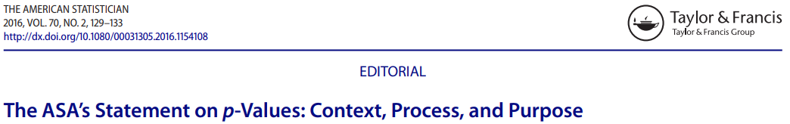
```

Six principles:

1. $p$-values can indicate how incompatible the data are with a specified statistical model.
2. $p$-values do not measure the probability that the studied hypothesis is true, or the probability that the data were produced by random chance alone.
3. Scientific conclusions and business or policy decisions should not be based only on whether a $p$-value passes a specific threshold.
4. Proper inference requires full reporting and transparency.
5. A $p$-value, or statistical significance, does not measure the size of an effect or the importance of a result.
6. By itself, a $p$-value does not provide a good measure of evidence regarding a model or hypothesis.

## ASA 2019 [@wasserstein2019a]
```{r, out.width='80%', fig.align='center', fig.cap='', out.extra='style="background-color: #000000; padding:5px;"'}

```

This is an editorial of a special issue consisting of 43 (!!) papers.

Main ideas:

- "Don't" is not enough -- Some *what to do* advices are provided.
- However... Don’t say “statistically significant” -- Just <span style="color:red">**don't**</span>.

> "(...) it is time to stop using the term “statistically significant” entirely. Nor should variants such as “significantly different,” “$p < 0.05$,” and “nonsignificant” survive, whether expressed in words, by asterisks in a table, or in some other way."

But:

> "Despite the limitations of p-values (...), however, we are not recommending that the calculation and use of continuous
$p$-values be discontinued. Where $p$-values are used, they should be reported as continuous quantities (e.g., $p = 0.08$).
They should also be described in language stating what the value means in the scientific context."

- There is no unique "do":

> "What you will NOT find in this issue is one solution that majestically replaces the outsized role that statistical significance has come to play."

- Accept uncertainty. Be thoughtful, open, and modest.

- Editorial, educational and other institutional practices will have to change.
<br>
This includes: Journals, funding agencies, education, career system.

- Value replicability, open materials and data, and reliable practices (which all take time) over "publish or perish".

## ASA 2019: Also advocate Bayesian statistics
```{r, out.width='50%', fig.align='center', fig.cap='', out.extra='style="background-color: #000000; padding:5px;"'}
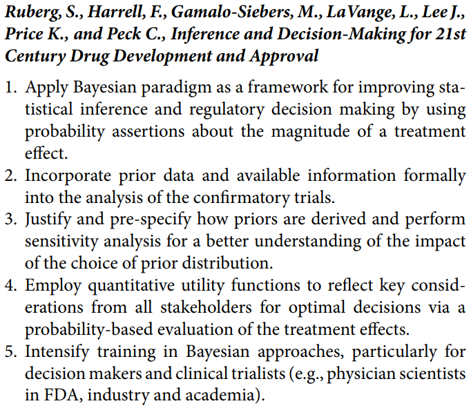
```

# What do experts advice?

## @munafo2017
```{r, out.width='80%', fig.align='center', fig.cap='', out.extra='style="background-color: #000000; padding:5px;"'}
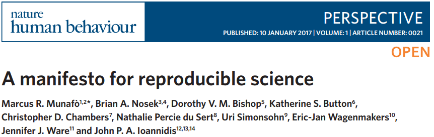
```

Methods:

- Protecting against cognitive biases
- Improving methodological training
- Implementing independent methodological support
- Encouraging collaboration and team science

## @munafo2017
```{r, out.width='100%', fig.align='center', fig.cap='', out.extra='style="background-color: #000000; padding:5px;"'}
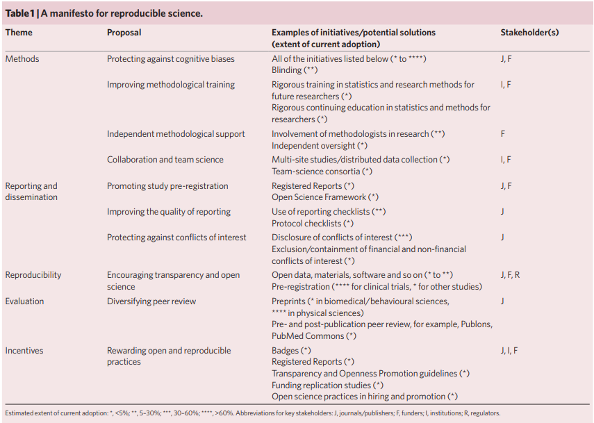
```

# Key ideas
## Better education [@button2018]

```{r, out.width='100%', fig.align='center', fig.cap='', out.extra='style="background-color: #000000; padding:5px;"'}
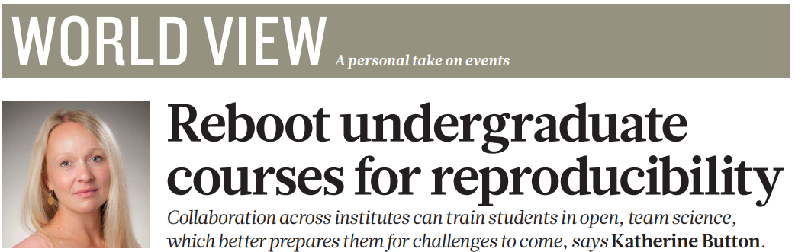
```

## Registered reports 
Visit the [Center for Open Science](https://cos.io/rr/).

```{r, out.width='80%', fig.align='center', fig.cap='', out.extra='style="background-color: #000000; padding:5px;"'}

```
<br>

*Prior* to data collection [@chambers2013]:

- Decide hypotheses, methods, and analysis.
<br>
(Eliminate several QRPs, e.g., $p$-hacking, hiding null findings.)
- Peer review of paper.
- Conditional acceptance of paper!
- Not only original studies, but also replications are of value!

## Registered reports 
As of July 2019, 205 journals use Registered Reports.


To learn:

- @nosek2014: Special issue in *Social Psychology* in 2014, with examples.
- @chambers2014: Includes useful FAQs.
- @chambers2017: [Slides](https://osf.io/ux24b/) at OSF.

## Preregistration

## Preregistration *works* [@kaplan2015]

```{r, out.width='50%', fig.align='center', fig.cap='', out.extra='style="background-color: #000000; padding:5px;"'}
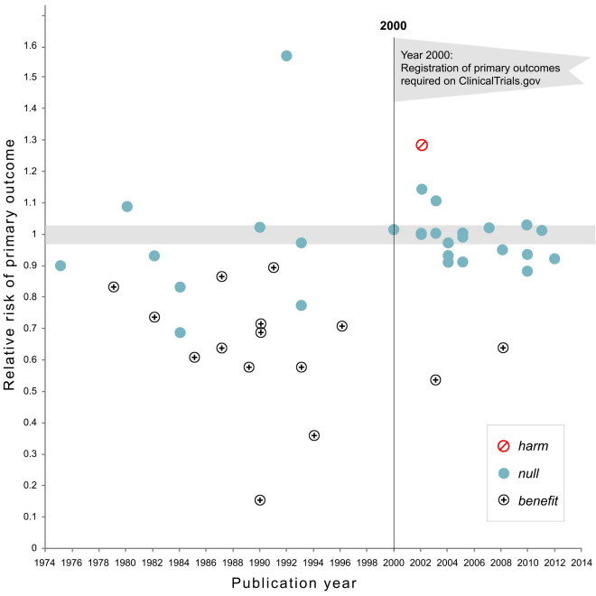
```

## 'statcheck'
R package that can assist detecting statistical reporting of errors [@nuijten2016].

# What to avoid

## Bullying

- Debates in blogs, Twitter, and journals can be fierce.
- Criticism should be part of science, of course.
- It's not bullying to criticize, of course, in particular, with grounded reasons (vide Wansink).
- But sometimes criticism gets too carried away, IMHO.
<br><br>

```{r, out.width='55%', fig.align='center', fig.cap='', out.extra='style="background-color: #000000; padding:5px;"'}
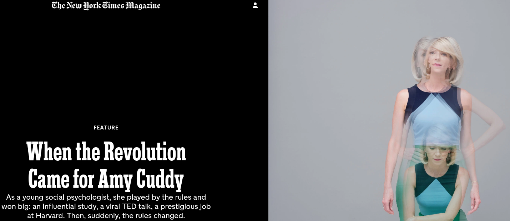
```
[NYT, 2017](https://www.nytimes.com/2017/10/18/magazine/when-the-revolution-came-for-amy-cuddy.html)

(Interestingly: A comeback in [Psychological Science](https://journals-sagepub-com.proxy-ub.rug.nl/eprint/CzbNAn7Ch6ZZirK9yMGH/full).)


<style type="text/css">
slides > slide { overflow: scroll; }
}
</style>

# References

----


