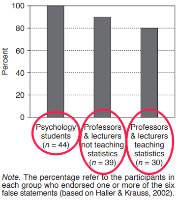

```{r setup, include=FALSE}
knitr::opts_chunk$set(echo = FALSE)
```

# Fraud

## Definition
Fraud = scientifc misconduct.

- Falsifying data.
- Fabricating data.
- 


# Questionable research practices

## QRPs
Coin termed by @john2012.<br>
See also @simmons2011.
<br><br>

- Not necessarily fraud.
- Includes the (ab)use of actually *acceptable* research practices.
- Problem with QRPs:<br>
    * Introduce bias (typically, in *favor* of the researcher's intentions...).
    * Inflated power at the cost of inflated Type I error probability ($\gg 5\%$).
    * Results not replicable.

## QRPs
Some examples [@john2012; @schimmack2015]: 

- Omit some DVs.
- Omit some conditions.
- Uncontrolled sequential testing --- Look and decide:
    * $p > .05$: Collect more.
    * $p < .05$: Stop.
- $p = .054 \longrightarrow p = .05$.
- Only report $p<.05$ results.
- Exclusion of outliers dependent on $p$.
- Convert exploratory result into research question.
- ...


# But *why*?...

## Why risking scientific misconduct?
It is strongly related to incentives [@nosek2012; @schonbrodt2015].

- "Publish or perish":<br>
Publish a lot, at highly prestigious journals.
- Journals only publish a fraction of all manuscripts.
- 

# $p$-values

## Definition
Probability of an effect at least as extreme as the one we observed, *given that $\mathcal{H}_0$ is true*.


\[\fbox{$ p\text{-value} = P\left(X_\text{obs} \text{ or more extreme}|\mathcal{H}_0\right) $}\]

The definition is simple enough, right?...
<br><br>

Consider the following statement [@gigerenzer2004]:

> *Suppose you have a treatment that you suspect may alter performance on a certain task. You compare the
means of your control and experimental groups (say, 20 subjects in each sample). Furthermore, suppose you
use a simple independent means $t$-test and your result is significant ($t = 2.7$, $df = 18$, $p = .01$). Please mark
each of the statements below as "true" or "false."* False *means that the statement does not follow logically
from the above premises. Also note that several or none of the statements may be correct.*

## Definition
[@gigerenzer2004, p. 3 PDF]:
<br><br>

```{r, out.width='100%', fig.align='center', fig.cap=''}
knitr::include_graphics('figures/Gigerenzer p values.png')
```

## Definition
**All** statements are incorrect. But how did students and teachers perceive these statements?

```{r, out.width='40%', fig.align='center', fig.cap=''}

```

## Definition
This was in 2004. But things did not improve since; see 


## If $p$-values are inflated... What to do?
Publication bias and QRPs ($p$-hacking) inflate $p$-values. Can we "deflate" them?

- $p$-curve; see @simonsohn2014, @simonsohn2014a, or a [5 min Youtube clip](https://www.youtube.com/watch?time_continue=298&v=V7pvYLZkcK4).

> "$p$-curve is the distribution of statistically significant $p$ values for a set of studies ($ps < .05$)."

- $z$-curve; see 

See @schonbrodt2015a for a nice presentation.


<style type="text/css">
slides > slide { overflow: scroll; }
}
</style>

# References

----


