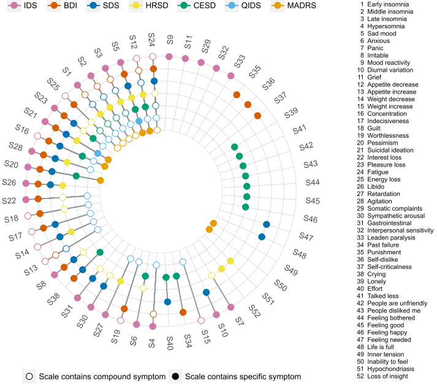
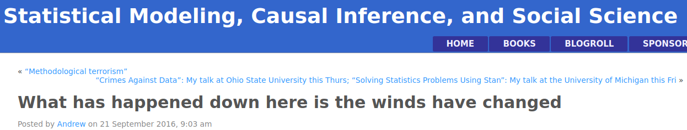
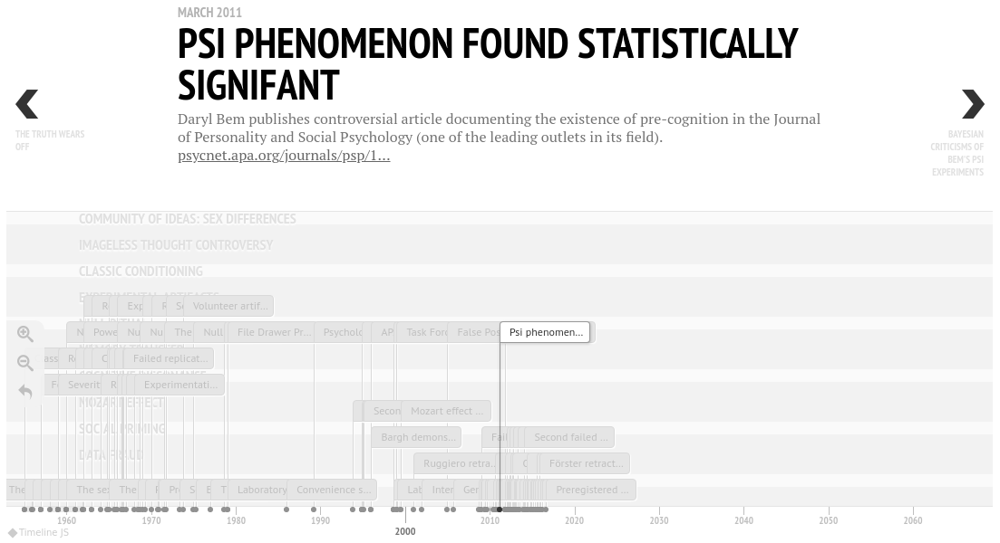
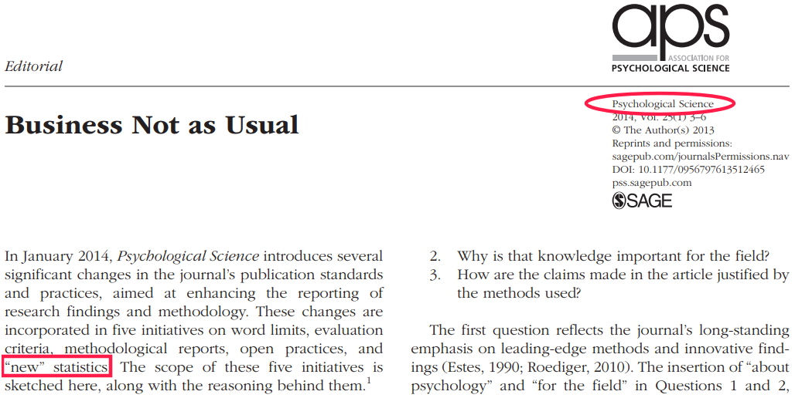
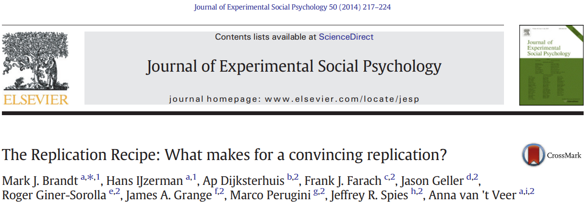
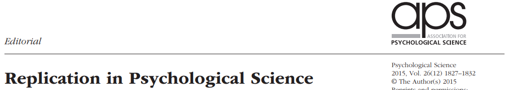

```{r setup, include = FALSE, fig.align = 'center'}
knitr::opts_chunk$set(
  echo      = FALSE, 
  fig.cap   = '', 
  out.extra = 'style="background-color: #000000; padding:5px; display:block; margin:auto;"'
  ) 
```

<!-- To print to PDF, run: 
pagedown::chrome_print("Nagoya-10-Aug-2019-Part1.html")
-->

# Fraud

## Definition
Fraud = scientifc misconduct.

- Falsifying or fabricating data.
- This is intentional, not accidental. 
- Puts all science under a <span style="color:red">bad light</span>.
- Markedly different from QRPs (next).

## Notable examples  {.columns-2}
Diederik Stapel, social psychologist. Suspended in 2011. [Fabricating and manipulating data](https://www.nytimes.com/2013/04/28/magazine/diederik-stapels-audacious-academic-fraud.html?pagewanted=1&_r=0&src=recg)
<br><br>
```{r, out.width='90%'}
knitr::include_graphics('figures/Stapel.jpg')
```

Jens Förster, social psychologist. Resigned in 2017. [Data tampering](https://retractionwatch.com/2017/12/12/psychologist-fire-leaves-university-start-private-practice/).
<br><br>
```{r, out.width='100%'}

```


# Questionable research practices

## QRPs
Coin termed by @john2012.<br>
See also @simmons2011.
<br><br>

- <span style="color:red">Not necessarily</span> fraud.
- Includes the (ab)use of actually *acceptable* research practices.
- Problem with QRPs:<br>
    * Introduce <span style="color:red">bias</span> (typically, in *favor* of the researcher's intentions...).
    * <span style="color:red">Inflated power</span> at the cost of inflated Type I error probability ($\gg 5\%$).
    * Results <span style="color:red">not replicable</span>.

## QRPs
Some examples [@john2012; @schimmack2015]: 

- Omit some DVs.
- Omit some conditions.
- <span style="color:red">Peeking</span>: Sequential testing --- Look and decide:
    * $p > .05$: Collect more.
    * $p < .05$: Stop.
- Only report $p<.05$ results.
- <span style="color:red">$p$-hacking</span>: E.g., 
    - exclusion of outliers dependent on $p$.
    - $p = .054 \longrightarrow p = .05$.
- <span style="color:red">HARKing</span> [@kerr1998]: Convert exploratory result into research question.
- ...

## Researcher's degrees of freedom
- Researchers have a multitude of decisions to make (experiment design, data collection, analyses performed); @wicherts2016.
- It is very possible to manipulate results *in favor* of one's interests.
- This is now known as *researcher's degrees of freedom* [@simmons2011].
- Consequence: Inflated false positive findings [@ioannidis2005].

## @fried2017
<div style="float: left; width: 50%;">
```{r, out.width='100%'}

```
</div>

<div style="float: right; width: 45%;">
- The 7 most common depression scales contain 52 symptoms.
- That's 7 different sum scores.
- Yet, all are interpreted as `level of depression'.
</div>

## A now famous example...
Prof. Brian Wansink at Cornell University.

[His description](https://web.archive.org/web/20170312041524/http:/www.brianwansink.com/phd-advice/the-grad-student-who-never-said-no) of the efforts of a visiting Ph.D student:

> I gave her a <span style="color:red">data set</span> of a self-funded, failed study which had <span style="color:red">null results</span> (...). I said, "This cost us a lot of time and our own money to collect. There’s got to be something here we can salvage because it’s a cool (rich & unique) data set." I had three ideas for potential Plan B, C, & D directions (since Plan A had failed). I told her what the analyses should be and what the tables should look like. I then asked her if she wanted to do them.

> Every day she came back with puzzling new results, and every day we would scratch our heads, ask "Why," and come up with another way to reanalyze the data with yet another set of plausible hypotheses. Eventually <span style="color:red">we started discovering solutions</span> that held up regardless of how we pressure-tested them. I outlined the first paper, and she wrote it up (...). This happened with a second paper, and then a third paper (which was one that was based on her own discovery while digging through the data).

<br><br>

This isn't creative, thinking outside the box, or worthy in any way.

<span style="color:red">This is QRPing.</span>

## What happened to Wansink?
- He was severely criticized, his work was scrutinized [e.g., @vanderzee2017].
- Over 100 (!!) errors in a set of four papers...
- Has now <span style="color:red">40</span> (!!) publications [retracted](http://retractiondatabase.org/RetractionSearch.aspx#?auth%3dWansink%252c%2bBrian) (as of July 2019).
- After a year-long internal investigation, he was forced to [resign](https://news.cornell.edu/stories/2018/09/provost-issues-statement-wansink-academic-misconduct-investigation).

## Other [famous failures](https://bit.ly/2y7qeer)
- The [Marshmallow Test](https://www.vox.com/science-and-health/2018/6/6/17413000/marshmallow-test-replication-mischel-psychology) [@watts2018]
- [Ego depletion](https://digest.bps.org.uk/2017/12/14/strongest-evidence-yet-for-ego-depletion-the-idea-that-self-control-is-a-limited-resource/) [@hagger2016; @vadillo2018; @friese2019]
- [Power posing](https://www.ted.com/talks/amy_cuddy_your_body_language_shapes_who_you_are#t-543464) [@ranehill2015]
- The [Stanford Prison Experiment](https://medium.com/s/trustissues/the-lifespan-of-a-lie-d869212b1f62) [@reicher2006;@griggs2014]
- The [facial feedback hypothesis](https://digest.bps.org.uk/2016/09/01/no-reason-to-smile-another-modern-psychology-classic-has-failed-to-replicate/) [@wagenmakers2016]
- [Newborn babies’ imitation](https://digest.bps.org.uk/2016/05/20/a-classic-finding-about-newborn-babies-imitation-skills-is-probably-wrong/) [@oostenbroek2016]
- The [blocking effect](https://www-nature-com.proxy-ub.rug.nl/news/psychologists-fail-to-replicate-well-known-behaviour-linked-to-learning-1.20659) [@maes2016]
- [The stereotype threat](https://www.nationalreview.com/corner/another-replication-failure-stereotype-threat-is-probably-empty/) [@flore2019]
- The [facial expression](https://www.popsci.com/article/science/facial-expressions-arent-universal-we-thought/#page-2) [@gendron2018]
- [ESP](https://www.theguardian.com/science/2012/mar/15/precognition-studies-curse-failed-replications), of course! [@ritchie2012;@galak2012]
- The Mozart Effect [@steele1999]
- ...

## Is it really *that* bad?...
[Yes](https://www.westernalliance.org.au/2018/05/restoring-trust-in-science-what-are-questionable-research-practices).

- @martinson2005: "Scientists behaving badly".
- @fanelli2009: Meta-analysis shows evidence of science misconduct.
- @john2012: Evidence for QRPs in psychology.
- @mobley2013: Reported evidence of pressure to *find* significant results.
- @agnoli2017: Evidence of QRPs, now in Italy.
- @fraser2018: In other fields of science.
<br><br>

Interestingly, science misconduct has been a longtime concern [see @babbage1830].
<br><br>

There are also some voices against this state of affairs [e.g., @fiedler2016].

# But *why*?...

## Why risking scientific misconduct?
It is strongly related to incentives [@nosek2012; @schonbrodt2015].

- "Publish or perish":<br>
Publish a lot, at highly prestigious journals.
- Journals only publish a fraction of all manuscripts.
- Get tenured.
- Get research grant.
- Fame (prizes, press coverage, ...).

# (I)reproducibility

## Threats to reproducible science
```{r, out.width='60%'}
knitr::include_graphics('figures/Mufano et al (2017).png')
```
<br><br>

[@munafo2017]

## Lack of replications
Until very recently [@makel2012].
<br><br>

```{r, out.width='90%'}
knitr::include_graphics('figures/Makel 2012.png')
```

# Didn't we see this coming?
## @meehl1967
<div style="float: left; width: 40%;">
```{r, out.width='70%'}
knitr::include_graphics('figures/Meehl.jpg')
```
</div>

<div style="float: right; width: 55%;">
How poorly we build theory (see [Gelman](https://statmodeling.stat.columbia.edu/2016/05/06/needed-an-intellectual-history-of-research-criticism-in-psychology/)):

> "It is not unusual that (e) this *ad hoc* challenging of auxiliary hypotheses is repeated in the course of a series of related experiments, in which <span style="color:red">the auxiliary hypothesis involved in Experiment 1</span> (...) <span style="color:red">becomes the focus of interest in Experiment 2</span>, which in turn utilizes further plausible but easily challenged auxiliary hypotheses, and so forth. In this fashion a zealous and clever investigator can slowly wend his way through (...) a long series of related experiments (...) <span style="color:red">without ever once refuting or corroborating</span> so much as a single strand of the network."

</div>

## Say what?...
```{r, out.width='100%'}
knitr::include_graphics('figures/tylervigen.png')
```

[http://www.tylervigen.com/spurious-correlations](http://www.tylervigen.com/spurious-correlations)

## @cohen1962
<div style="float: left; width: 40%;">
```{r, out.width='70%'}
knitr::include_graphics('figures/Cohen.jpg')
```
</div>

<div style="float: right; width: 55%;">
Low-powered experiments:

> "(...) It was found that the average power (probability of rejecting false null hypotheses) over the 70 research studies was .18 for small effects, .48 for medium effects, and .83 for large effects. These values are deemed to be <span style="color:red">far too small</span>."
<br><br>
"(...) it is recommended that investigators use <span style="color:red">larger sample sizes</span> than they customarily do."

</div>

## Kahneman (2012), see [here](https://www.nature.com/news/polopoly_fs/7.6716.1349271308!/suppinfoFile/Kahneman%20Letter.pdf)
<div style="float: left; width: 40%;">
```{r, out.width='70%'}
knitr::include_graphics('figures/Kahneman.jpg')
```

Nobel prize winner, 2002.
</div>

<div style="float: right; width: 55%;">
About priming effects (but quite general remarks...):

> "The storm of doubts is fed by (...) the recent exposure of fraudulent researchers, general concerns with replicability (...), multiple reported failures to replicate salient results (...), and the growing belief in the existence of a pervasive file drawer problem (...)."
<br><br>
"My reason for writing this letter is that <span style="color:red">I see a train wreck looming</span>."
<br><br>
"I believe that you should <span style="color:red">collectively do something</span> about this mess."

</div>


## Timeline of a train wreck
```{r, out.width='100%'}

```

- Gelman blogged an impressive [timeline](https://statmodeling.stat.columbia.edu/2016/09/21/what-has-happened-down-here-is-the-winds-have-changed/) about the replication crisis. 
- The whole blog post is worth reading for many reasons, including Gelman's rebuttal to a strong defender of the traditional *status quo*.

## Timeline of a train wreck
See also this impressive dynamic plot:<br>
[https://psyborgs.github.io/projects/replication-in-psychology/](https://psyborgs.github.io/projects/replication-in-psychology/)

```{r, out.width='70%'}

```


# Large-scale replication projects
## Many Labs [@klein2014]
```{r, out.width='55%'}

```

Replicability of 13 classic and contemporary effects across 36 independent samples totaling 6,344 participants.

See also Many Labs 2 [@klein2018], Many Labs 3 [@ebersole2016].

## Open Science Collaboration [@osc2015]
```{r, out.width='35%'}
knitr::include_graphics('figures/OSC1.jpg')
```
<br><br>

A gazilion authors.

(For the sake of balance, and for an interesting rebuttal (!), see @gilbert2016).

## The Psychological Science Accelerator
@moshontz2018a; 92 authors!

```{r, out.width='90%'}
knitr::include_graphics('figures/Moshontz et al 2018.png')
```


# Publication policies

## Psychological Science [@eich2014]
```{r, out.width='90%'}

```

## Basic and Applied Social Psychology
```{r, out.width='80%'}
knitr::include_graphics('figures/BASP 2015.png')
```

> "The Basic and Applied Social Psychology (BASP) (...) emphasized that the null hypothesis significance testing procedure (NHSTP) is <span style="color:red">invalid</span> (...). From now on, <span style="color:red">BASP is banning the NHSTP</span>."

## Child Adolescent Mental Health [@spreckelsen2018]
```{r, out.width='90%'}
knitr::include_graphics('figures/CAMH 2018.png')
```

## The New England Journal of Medicin 
```{r, out.width='60%'}
knitr::include_graphics('figures/TNEJOM Editorial 2019.png')
```

Editorial [@harrington2019].

> "(...) a requirement to <span style="color:red">replace $p$ values</span> with estimates of effects or association and 95% confidence intervals"

# Education

## @frank2012
```{r, out.width='90%'}

```

## @sarafoglou2019
```{r, out.width='60%'}
knitr::include_graphics('figures/Sarafoglou et al 2019.png')
```

Research Master course on open science practices. Materials available (add link)!

## @chambers2017a
```{r, out.width='30%'}

```

## @kiers2019
```{r, out.width='100%'}
knitr::include_graphics('figures/SIPS 2019 Kiers.png')
```

# $p$-values

## Definition
> Probability of an effect at least as extreme as the one we observed, *given that $\mathcal{H}_0$ is true*.


\[\fbox{$ p\text{-value} = P\left(X_\text{obs} \text{ or more extreme}|\mathcal{H}_0\right) $}\]

The definition is simple enough, right?...

## Test yourself
Consider the following statement [@oakes1986; @falk1995; @haller2002; @gigerenzer2004]:

> *Suppose you have a treatment that you suspect may alter performance on a certain task. You compare the
means of your control and experimental groups (say, 20 subjects in each sample). Furthermore, suppose you
use a simple <span style="color:red">independent means $t$-test</span> and your result is <span style="color:red">significant</span> ($t = 2.7$, $df = 18$, $p = .01$). Please mark
each of the statements below as "true" or "false."* False *means that the statement does not follow logically
from the above premises. Also note that several or none of the statements may be correct.*

## Test yourself
```{r, out.width='100%'}
knitr::include_graphics('figures/Gigerenzer p values.png')
```

## Results
**All** statements are <span style="color:red">incorrect</span>. 

## Results
But how did students and teachers perceive these statements? (see other plots)

```{r, out.width='35%'}
knitr::include_graphics('figures/Gigerenzer p values 2.png')
```

This was in 2004. But things did not improve since...

## @goodman2008

```{r, out.width='60%'}
knitr::include_graphics('figures/Goodman.png')
```
<br>

```{r, out.width='85%'}

```

## @greenland2016

```{r, out.width='80%'}
knitr::include_graphics('figures/Greenland.png')
```

<br><br><br>

This paper expands @goodman2008 and elaborates on 25 (yes, 二十五!!!) misinterpretations.

## If $p$-values are inflated... What to do?
Publication bias and QRPs ($p$-hacking) inflate $p$-values. Can we "deflate" them?

- $p$-curve; see @simonsohn2014, @simonsohn2014a, or a [5 min Youtube clip](https://www.youtube.com/watch?time_continue=298&v=V7pvYLZkcK4).

> "$p$-curve is the distribution of statistically significant $p$ values for a set of studies ($ps < .05$)."

- $z$-curve; see 

See @schonbrodt2015a for a nice presentation. (add link)

# Confidence intervals

## A better alternative?
- Confidence intervals (CIs) have been often advocated as the best inferential alternative to NHST.
- Recall, for example the Wilkinson Task Force:

> "(...) it is hard to imagine a situation in which a dichotomous accept–reject decision is better than reporting an actual $p$-value or, better still, a <span style="color:red">confidence interval</span>.”

- But, are CIs really a better alternative? 

## Definition (e.g., rink's paper)
> A (say) 95% CI is a numerical interval found through a procedure that, if repeated across a series of hypothetical data, leads to an interval covering the true parameter 95% of the times.

- A CI indicates a property of the performance of the <span style="color:red">procedure</span> used to compute it:<br>
How is the <span style="color:red">procedure</span> expected to perform in the long run?
- A CI for a parameter is constructed <span style="color:red"> around the parameter's estimate</span>.
- However, a CI does not (really <span style="color:red">not</span>!) directly indicate a property of the parameter being estimated!
<br><br>

Confused?<br>
So is the vast majority of the social sciences population...

## Test yourself
From rink's paper, mimicking the $p$ value study by @gigerenzer2004.

Rink's Appendix 2.
The setting

## Test yourself
Rink's Appendix 2.
The 6 statements.

## Results
**All** statements are <span style="color:red">incorrect</span>. 

## Results
But how did students and teachers perceive these statements?

Put screenshot of rink's table 1.

See also the ryan paper for extra confusion.

## What would be correct, then?...
> “If we were to repeat the experiment over and over, then 95% of the time the confidence intervals contain the true mean.”
(rink's paper)

How informative is this?!
<br><br><br>

Mental note:<br>
Remember this when interpreting <span style="color:red">Bayesian credible intervals</span> in part 1 of today's workshop!
<br><br><br>

For completeness, not everyone agrees with the Hoekstra study (miller and garcia-perez papers, and morey reply).


# What do statistical associations advice?

## Task Force 1999

## ASA 2016 [@wasserstein2016]
```{r, out.width='70%'}
knitr::include_graphics('figures/Wasserstein2016.png')
```

Six principles:

1. $p$-values can indicate how incompatible the data are with a specified statistical model.
2. $p$-values do not measure the probability that the studied hypothesis is true, or the probability that the data were produced by random chance alone.
3. Scientific conclusions and business or policy decisions should not be based only on whether a $p$-value passes a specific threshold.
4. Proper inference requires full reporting and transparency.
5. A $p$-value, or statistical significance, does not measure the size of an effect or the importance of a result.
6. By itself, a $p$-value does not provide a good measure of evidence regarding a model or hypothesis.

## ASA 2019 [@wasserstein2019]
```{r, out.width='80%'}
knitr::include_graphics('figures/Wasserstein2019.png')
```

This is an editorial of a special issue consisting of 43 (!!) papers.

Main ideas:

- "Don't" is not enough -- Some *what to do* advices are provided.
- However... Don’t say “statistically significant” -- Just <span style="color:red">**don't**</span>.

> "(...) it is time to <span style="color:red">stop</span> using the term “statistically significant” entirely. Nor should variants such as “significantly different,” “$p < 0.05$,” and “nonsignificant” survive, whether expressed in words, by asterisks in a table, or in some other way."

But:

> "Despite the limitations of $p$-values (...), however, we are not recommending that the calculation and use of continuous
$p$-values be discontinued. Where $p$-values are used, they should be reported as continuous quantities (e.g., $p = 0.08$).
They should also be described in language stating what the value means in the scientific context."

- There is no unique "do":

> "What you will NOT find in this issue is one solution that majestically replaces the outsized role that statistical significance has come to play."

- <span style="color:red">Accept uncertainty</span> (I cannot stress this enough!). <br>
Be thoughtful, open, and modest.

- Editorial, educational, and other institutional practices will have to change.
<br>
This includes: Journals, funding agencies, education, career system.

- Value replicability, open materials and data, and reliable practices (which all take time) over "publish or perish".

## ASA 2019: Also advocate Bayesian statistics
```{r, out.width='50%'}
knitr::include_graphics('figures/Ruberg2019.png')
```

# What do experts advice?

## @munafo2017
```{r, out.width='80%'}
knitr::include_graphics('figures/Mufano et al (2017) 2.png')
```

Methods:

- Protecting against cognitive biases
- Improving methodological training
- Implementing independent methodological support
- Encouraging collaboration and team science

## @munafo2017
```{r, out.width='100%'}
knitr::include_graphics('figures/Mufano et al (2017) 3.png')
```

# Key ideas
## Better education [@button2018]

```{r, out.width='100%'}

```

## Registered reports 
Visit the [Center for Open Science](https://cos.io/rr/).

```{r, out.width='75%'}
knitr::include_graphics('figures/COS.png')
```
<br>

*Prior* to data collection [@chambers2013]:

- Decide hypotheses, methods, and analysis.
<br>
(Eliminate several QRPs, e.g., $p$-hacking, publication bias by researchers and journals.)
- Peer review of paper.
- Conditional acceptance of paper!
- Not only original studies, but also replications are of value!

## Registered reports 
As of July 2019, 205 journals use Registered Reports. (add link)


To learn:

- @nosek2014: Special issue in *Social Psychology* in 2014, with examples.
- @chambers2014: Includes useful FAQs.
- @chambers2017: [Slides](https://osf.io/ux24b/) at OSF.

## Preregistration

## Preregistration *works* [@kaplan2015]

```{r, out.width='45%'}

```

## Replication studies
@brandt2014

```{r, out.width='90%'}

```

## Concern in major journals
@lindsay2015

```{r, out.width='75%'}

```

> "(...) Replicability is not the only criterion of a first-rate science journal, but it had better be a <span style="color:red">fundamental</span> one."

> "My emphasis here is on experiments and NHST, (...) (By the way, I am enthusiastically open to submissions that make appropriate use of <span style="color:red">alternatives to NHST</span> [read: Bayes].)"

## In *Nature*
```{r, out.width='75%'}
knitr::include_graphics('figures/Camerer 2018.png')
```


## In Nature [@camerer2018]
> "The replications follow <span style="color:red">analysis plans reviewed by the original authors</span> and <span style="color:red">pre-registered</span> prior to the replications."

> The replications are high powered, with <span style="color:red">sample sizes on average about five times higher</span> than in the original studies."

> "We find a <span style="color:red">significant effect in the same direction</span> as the original study for 13 (<span style="color:red">62%</span>) studies, and the <span style="color:red">effect size</span> of the replications is on average <span style="color:red">about 50%</span> of the original effect size."

Conclusion:<br>
Results published in high rank journals should be considered with care until they are <span style="color:red">replicated</span>.

## The PRO initiative [@morey2016a]
- PRO = <span style="color:red">P</span>eer <span style="color:red">R</span>eviewers' <span style="color:red">O</span>penness.
- Thus, guidelines for paper <span style="color:red">reviewers</span>.
- See [https://opennessinitiative.org](https://opennessinitiative.org).
<br><br><br>

Main [goals](https://opennessinitiative.org/the-initiative/):

1. Data should be made publicly available.
2. Stimuli and materials should be made publicly available.
3. In case some data or materials are not open, clear reasons (e.g., legal, ethical constraints, or severe impracticality) should be given why.
4. Documents containing details for interpreting any files or code, and how to compile and run any software programs should be made available with the above items. 
5. The location of all of these files should be advertised in the manuscript, and all files should be hosted by a reliable third party.


## 'statcheck'
R package that can assist detecting statistical reporting of errors [@nuijten2016].

# What to avoid

## Bullying

- Debates in blogs, Twitter, and journals can be fierce.
- Criticism <span style="color:red">should be part</span> of science, of course.
- It's not bullying to criticize, of course, in particular, with grounded reasons (vide Wansink).
- But sometimes criticism gets <span style="color:red">too carried away</span>, IMHO.
<br><br>

```{r, out.width='50%'}
knitr::include_graphics('figures/AmyCuddy_NYT2017.png')
```
[NYT, 2017](https://www.nytimes.com/2017/10/18/magazine/when-the-revolution-came-for-amy-cuddy.html)

(Interestingly: A recent comeback in [Psychological Science](https://journals-sagepub-com.proxy-ub.rug.nl/eprint/CzbNAn7Ch6ZZirK9yMGH/full).)

## Self-appointed police
Most likely, each of us has some skeleton's in their scientific closets.

We've all fallen prey to one or more of the problems mentioned today.

Full disclosure:

> I have to!!

So: 

> *No one is better than anyone.*

Or in the words of Brian Nosek (as quoted [here](https://fivethirtyeight.com/features/psychologys-replication-crisis-has-made-the-field-better/)):

> "We’re not here to *be right*. We’re here to *get it right*."


# Warm-up Bayesian statistics
## Alternative
Lecoutre et al (2001) paper in rink's CI literature


<style type="text/css">
slides > slide { overflow: scroll; }
}
</style>

# References

----


